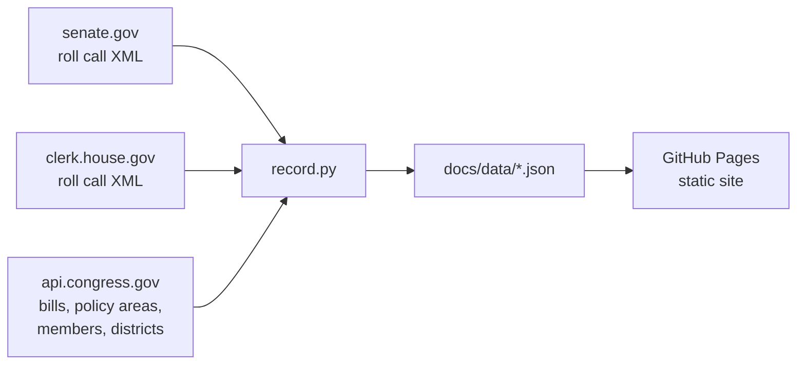

# Voter Info

A nonpartisan reference showing how every member of the U.S. Congress voted, grouped by issue. Every vote links back to the official roll call record.

**Live site:** https://thekennethrose.github.io/voter-info/

- Search any senator or representative by name, state, district or chamber
- See each member's recorded votes on bills, grouped by issue, plus Senate votes on nominations
- Look up procedural terms like *cloture* or *motion to recommit* in the [glossary](https://thekennethrose.github.io/voter-info/glossary.html)
- Read a plain-language guide to [how voting works](https://thekennethrose.github.io/voter-info/how-it-works.html), from elections to floor votes

Current data covers January 2021 through October 2026 (the 117th through 119th Congresses): 2,497 Senate roll calls and 2,837 House roll calls for 742 members.

## Principles

- **Official records only.** Votes come from senate.gov and the Clerk of the House. Bill titles, policy areas, member names and districts come from congress.gov. No vote is inferred, summarized or generated by an AI model.
- **Neutral presentation.** No ratings, scores or advocacy-group labels. The site shows the official wording of each vote. Yea and Nay use shapes, not colors, so nothing reads as good, bad or partisan.
- **Issues come from Congress, not from us.** Bills are grouped by the policy area the nonpartisan [Congressional Research Service](https://thekennethrose.github.io/voter-info/glossary.html#crs) assigns to each one. We don't hand-pick which bills count as "healthcare" or "immigration."
- **Show the procedure.** A cloture vote or motion to proceed isn't a vote on a bill's contents. Every vote keeps its official title, and the glossary explains each kind.

## How it works



There is no server or database. `record.py` downloads the official records, builds compact JSON files, and commits them to `docs/data/`. GitHub Pages serves `docs/` as a static site, and each page loads only the JSON it needs in the browser.

### The build

1. **Senate:** read each session's vote list from senate.gov. Keep votes on bills and on nominations; skip treaties and procedural votes not tied to either.
2. **House:** get each session's roll call count from congress.gov, then download every roll call from the Clerk. Keep votes on bills; skip quorum calls, journal votes, adjournments and Speaker elections.
3. **Bills:** look up each bill's title and CRS policy area on congress.gov.
4. **Members:** take each member's votes from every roll call at once, then add representatives' full names and districts from congress.gov.

Recorded votes never change, so every roll call is downloaded once and cached in `data/cache/`, which is not committed. A first build from scratch takes an hour or more, mostly waiting on senate.gov's rate limit; rebuilds from cache take under a minute.

### Data layout

```
docs/data/
  members.json         every member: id, chamber, name, party, state, district, current
  votes/s119.json      Senate bills, nominations and vote details for the 119th Congress
  votes/h119.json      House bills and vote details for the 119th Congress
  casts/S414.json      one member's votes, one character per roll call
```

- **Member ids:** senators use their Senate LIS id (`S414`); representatives use their bioguide id (`A000370`). Someone who served in both chambers has two entries.
- **Vote files:** each member's file is packed one character per roll call number, per session, e.g. `{"119-1": "--Y-N…"}`. That keeps rebuilds small in git history. The codes are documented in [`CLAUDE.md`](CLAUDE.md).
- **Adding issues never adds files:** every bill already carries its policy area.

## Run it locally

Requires Python 3.10+ and git. The build uses only the Python standard library; `setup.sh` also installs the commit hooks.

```bash
git clone https://github.com/thekennethrose/voter-info.git
cd voter-info
bash setup.sh                         # virtualenv, dependencies, commit hooks, .env
```

Get a free congress.gov API key at [api.congress.gov/sign-up](https://api.congress.gov/sign-up/) and add it to `.env`:

```
CONGRESS_API_KEY=your-key
```

Then build and preview:

```bash
source .venv/bin/activate
set -a; source .env; set +a
python record.py                      # all sessions since 2021, or e.g. python record.py 119-1 119-2
python -m http.server -d docs 8000    # open http://localhost:8000
```

Pages load their data with `fetch`, so they need to be served over HTTP. Opening the HTML files directly won't work.

To check a single vote against the official record:

```bash
python votes.py senate 119-1 644 S414
python votes.py house 119-1 190 A000370
```

## Project layout

| Path | What it does |
| --- | --- |
| `record.py` | Builds `docs/data/` from all sources |
| `sources.py` | Fetching with pacing and retries, the roll call cache, vote classification, congress.gov lookups |
| `votes.py` | Parses Senate and House roll call XML; also a command-line lookup |
| `spinner.py` | Progress display for long builds |
| `docs/index.html` | Member directory and search |
| `docs/member.html` | One member's voting record |
| `docs/glossary.html` | Definitions of terms used in vote titles |
| `docs/how-it-works.html` | How elections and congressional votes work |
| `docs/site.css`, `docs/states.js` | Shared styles, state and party names |
| `voter_slice.py` | Early experiment summarizing positions with an LLM; not used by the site |

## Contributing

- `main` is protected. Work on a short-lived branch named `type/short-desc`, open a pull request, and squash-merge.
- Commit messages follow [Conventional Commits](https://www.conventionalcommits.org/), checked by a hook. The project also uses `data:` for data refreshes.
- Commit regenerated `docs/data/` along with the code that produced it; its history is the published record.
- Definitions and process descriptions must match official sources (senate.gov, house.gov, usa.gov, archives.gov, CRS). Cite the source when adding one.

See [`VERSION_CONTROL.md`](VERSION_CONTROL.md) for the full workflow. [`CLAUDE.md`](CLAUDE.md) has detailed architecture notes, written for AI coding assistants but useful to anyone.

### Things to know when changing the build

- **senate.gov throttles bulk downloads** with temporary 403 errors. Requests are spaced one second apart with long backoffs. Keep Senate downloads single-threaded.
- **clerk.house.gov returns HTTP 200 for roll calls that don't exist,** with a short error body. Responses are validated by content, never by status code.
- **congress.gov's API allows 5,000 requests an hour.** A cold build uses about 2,000, and bill lookups are cached once a policy area is assigned.

## Not yet included

- Votes on treaties, quorum calls, and procedural votes not tied to a bill or nominee
- Candidates who haven't served in Congress, and statements or positions outside the voting record
- A link between the Senate and House records of members who served in both

## Sources

- [U.S. Senate: how the Senate votes](https://www.senate.gov/about/powers-procedures/voting.htm), and its roll call votes as [XML](https://www.senate.gov/legislative/LIS/roll_call_lists/vote_menu_119_2.xml)
- [Clerk of the House roll call votes](https://clerk.house.gov/Votes)
- [Congress.gov API](https://api.congress.gov/) (Library of Congress)
